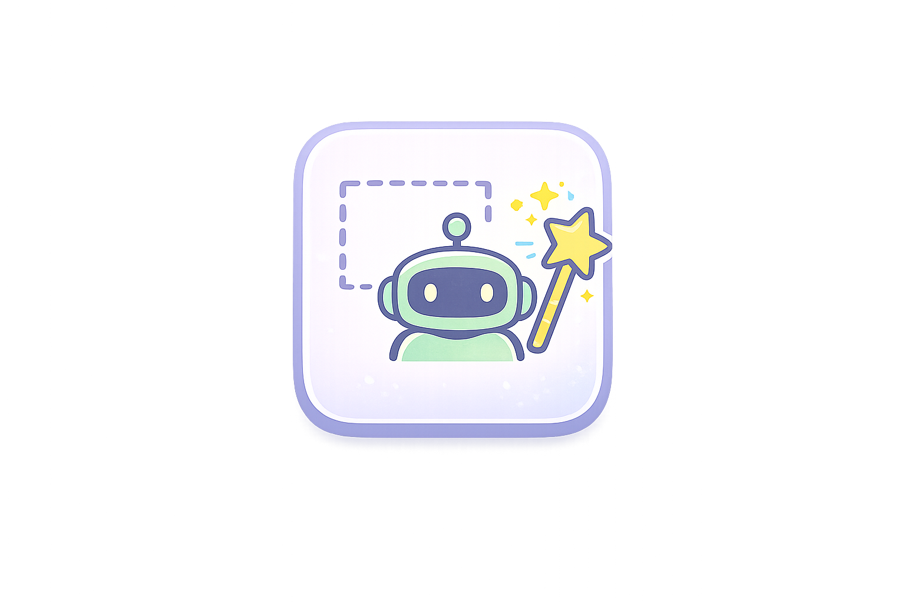
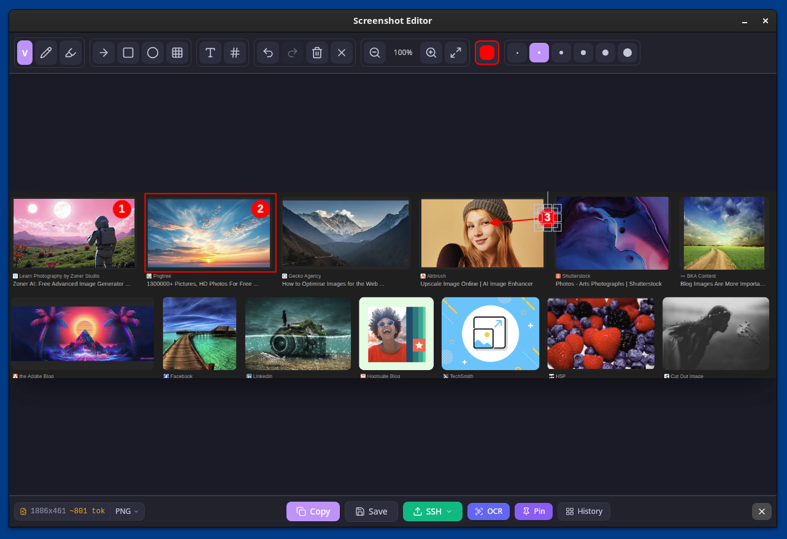
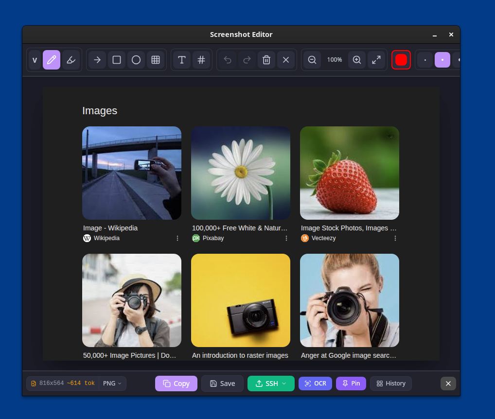
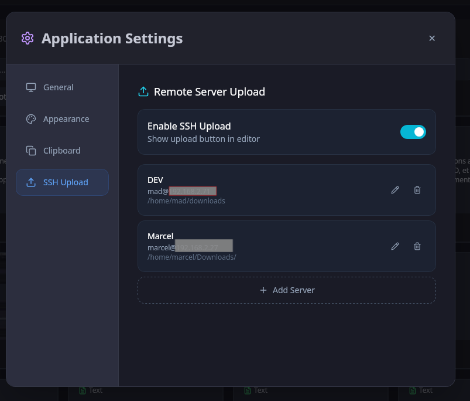
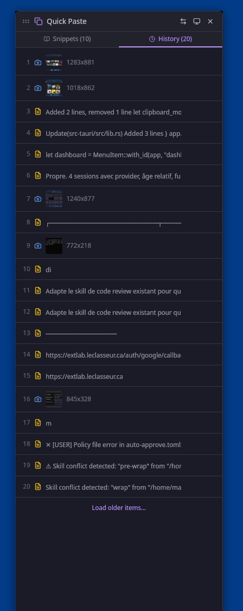
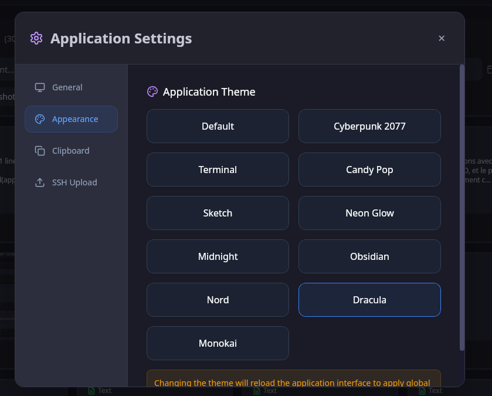

<p align="center">
  
</p>

<h1 align="center">Madera.Tools</h1>

<p align="center">
  
  
  
  
  
  
</p>

<p align="center">
  <strong>The screenshot tool built for the AI era.</strong>
  <br />
  Capture. Annotate. SSH upload to your servers. Paste into Claude, ChatGPT, or any AI. One keystroke.
  <br />
  <br />
  <a href="#installation">Install</a> &middot; <a href="#features">Features</a> &middot; <a href="#ssh-upload">SSH Upload</a> &middot; <a href="#quickpaste">QuickPaste</a> &middot; <a href="#themes">Themes</a> &middot; <a href="#architecture">Architecture</a>
</p>

---

<p align="center">
  
</p>

## Why Madera?

Every AI conversation starts the same way: *"here's a screenshot of..."*

Madera was built for developers who live in AI-assisted workflows. One hotkey captures your screen, opens a full annotation editor, and copies the result to your clipboard -- ready to paste into Claude, ChatGPT, Cursor, or any AI tool. No save dialogs. No file management. Just capture and paste.

**Working remotely?** SSH upload pushes screenshots directly to your servers -- configure multiple machines, and the remote path is copied to your clipboard for instant `@reference` in AI tools. Perfect for headless setups, pair programming over SSH, or sharing screenshots across your dev fleet.

But Madera goes further: **OCR text extraction**, **pinnable overlays**, **scroll capture**, a **token cost estimator**, **clipboard history with auto-paste**, and **prompt snippet management** -- all wrapped in 11 themes and running at native speed.

**~6MB binary. Zero Electron. Pure performance.**

## Features

### Screenshot Capture & Editor

- **Region selection** -- click and drag to capture any area of any monitor
- **Full annotation suite** -- pen, highlighter, arrows, rectangles, circles, text, numbered markers, blur/pixelate
- **Scroll capture** -- capture content that extends beyond the screen (multi-page, long logs)
- **Multi-monitor support** -- works across all your displays
- **Smart canvas sizing** -- image automatically fills the editor, adapts on resize
- **Export formats** -- PNG (lossless), JPEG (smallest), WebP (modern) -- choose per export

<p align="center">
  
</p>

### SSH Upload -- Built for Remote Developers

Push screenshots to any server with one click. Configure multiple SSH targets, and the remote URL is copied to your clipboard -- ready to paste as a reference in Claude, ChatGPT, or share with your team.

<p align="center">
  
</p>

### AI-Optimized

Madera is purpose-built for AI vision workflows:

- **Token cost estimator** -- real-time badge shows Claude vision token count and cost (`width * height / 750`)
- **Auto-resize to 1568px** -- optimal resolution for Claude, no wasted tokens on oversized images
- **OCR text extraction** -- extract text from any screenshot with one click (Tesseract.js, cross-platform, zero setup)
- **Pin screenshot overlay** -- pin a screenshot as an always-on-top draggable overlay while you discuss it with an AI
- **Format selector** -- switch between PNG/JPEG/WebP to optimize file size before sharing

### Unified Clipboard History

- **Everything in one place** -- screenshots, text clips, and color picks in a single searchable timeline
- **Background monitoring** -- adaptive polling (fast when active, slow when idle)
- **Auto-paste** -- select any item and it pastes directly into the focused window
- **Terminal-aware** -- auto-detects terminals and uses `Shift+Ctrl+V` instead of `Ctrl+V`
- **SQLite-backed** -- fast search across thousands of entries

### QuickPaste Snippets

<p align="center">
  
</p>

- **Instant access** -- `Ctrl+Alt+V` opens clipboard history, `Ctrl+Alt+Q` opens snippets
- **Text & image snippets** -- paste code blocks, boilerplate, prompt templates, or image assets
- **Auto-paste** -- selects a snippet and immediately types it into the active window
- **Smart positioning** -- panel anchors to the nearest screen edge, never between monitors
- **Cross-platform paste** -- `ydotool` (kernel), `wtype` (Wayland), `xdotool` (X11) with automatic fallback

### Color Picker

- **Pixel-perfect sampling** -- magnified view for precise color selection
- **All formats** -- HEX (upper/lower), RGB, HSL
- **Color history** -- every pick is saved and searchable

### Responsive Editor Toolbar

- **Wide window**: all actions visible -- Copy, Save, SSH, OCR, Pin, History
- **Narrow window**: secondary actions collapse into a `...` overflow menu automatically

### 11 Themes

Pick your vibe. Every theme applies across the entire app.

<p align="center">
  
</p>

| Theme | Style |
|-------|-------|
| **Default** | Clean dark blue |
| **Cyberpunk 2077** | Yellow-on-black, sharp edges |
| **Terminal** | Green phosphor CRT |
| **Candy Pop** | Pink pastel, rounded corners |
| **Sketch** | Light pencil-on-paper, dashed borders |
| **Neon Glow** | Purple/cyan gradients |
| **Midnight** | Deep navy blue |
| **Obsidian** | Warm dark with gold accents |
| **Nord** | Arctic blue palette |
| **Dracula** | Purple-accented dark |
| **Monokai** | Classic editor green |

## Installation

### From Source

**Prerequisites:** Node.js 18+, Rust toolchain, system dependencies for Tauri 2

```bash
# Clone
git clone https://github.com/mussonking/madera-screenshot-tool.git
cd madera-screenshot-tool

# Install dependencies
npm install

# Development mode (hot-reload)
npm run tauri dev

# Production build
npm run tauri build

# Install the binary (Linux)
sudo cp src-tauri/target/release/madera-tools /usr/bin/madera-tools
```

### Linux System Dependencies

```bash
# Ubuntu/Pop!_OS/Debian
sudo apt install libwebkit2gtk-4.1-dev libappindicator3-dev librsvg2-dev \
  libxdo-dev libx11-dev libxrandr-dev libxcomposite-dev libxdamage-dev \
  slop xdotool ydotool wtype  # region selection + paste tools
```

### Windows

Build with `npm run tauri build`. The resulting `.msi` / `.exe` installer is in `src-tauri/target/release/bundle/`.

## Keyboard Shortcuts

| Shortcut | Action |
|----------|--------|
| `Ctrl+Shift+S` | Capture screenshot |
| `Ctrl+Shift+H` | Open history |
| `Ctrl+Shift+X` | Color picker |
| `Ctrl+Alt+V` | QuickPaste (history tab) |
| `Ctrl+Alt+Q` | QuickPaste (snippets tab) |
| `Ctrl+C` | Copy annotated image (in editor) |
| `Ctrl+S` | Save to file (in editor) |
| `Ctrl+Z` / `Ctrl+Y` | Undo / Redo |
| `V` `P` `H` `A` `R` `C` `T` `N` `B` | Tool shortcuts (in editor) |
| `Escape` | Close current window |

### Custom Desktop Shortcuts

Global shortcuts use CLI flags. Set these up in your desktop environment's keyboard settings:

```bash
madera-tools --capture        # Screenshot
madera-tools --history        # History panel
madera-tools --colorpicker    # Color picker
madera-tools --quickpaste     # QuickPaste (history tab)
madera-tools --snippets       # QuickPaste (snippets tab)
```

## Architecture

```
madera-screenshot-tool/
  src/                          # React frontend
    components/
      Editor.tsx                # Fabric.js annotation canvas + AI tools
      Dashboard.tsx             # Main app screen
      History.tsx               # Unified clipboard history
      QuickPasteModal.tsx       # Snippet/history selector overlay
      PinView.tsx               # Pinned screenshot overlay
      SettingsModal.tsx         # App preferences + theme picker
      ColorPicker.tsx           # Pixel color sampler
    utils/
      theme.ts                  # 11 theme definitions (single source of truth)
    App.tsx                     # Hash-based view router
  src-tauri/src/                # Rust backend
    lib.rs                      # Core: 50+ commands, windows, tray, shortcuts
    snippet_manager.rs          # Snippet CRUD (JSON storage)
    history.rs                  # SQLite history management
    clipboard_monitor.rs        # Background clipboard watcher (adaptive polling)
    native_selection.rs         # Cross-platform screen capture (slop/slurp/Win32)
    wayland_focus.rs            # Focus tracking (Wayland + X11 fallback)
    color_picker.rs             # Pixel sampling + magnifier
```

### Tech Stack

| Layer | Technology |
|-------|-----------|
| Framework | Tauri 2 |
| Backend | Rust |
| Frontend | React 18 + TypeScript |
| Canvas | Fabric.js 6 |
| OCR | Tesseract.js |
| Styling | Tailwind CSS |
| Build | Vite 6 |
| Database | SQLite (rusqlite) |
| Icons | Lucide React |

## Cross-Platform

| Platform | Status |
|----------|--------|
| Linux (X11/GNOME) | Full support |
| Linux (Wayland/COSMIC) | Full support (layer-shell overlays) |
| Windows | Full support (Win32 native selection) |
| macOS | Partial (no layer-shell overlays) |

## Contributing

Contributions welcome! This project is built with Claude Code and designed to be AI-friendly:

- `CLAUDE.md` contains architecture docs for AI assistants
- Hash-based routing (no framework overhead)
- Clean Tauri command interface between frontend and backend
- Single theme system with clear separation

## License

MIT

---

<p align="center">
  Built with too much coffee by <a href="https://github.com/mussonking">@mussonking</a> and <a href="https://claude.ai/code">Claude Code</a> (Opus 4.6)
  <br />
  <sub>Entirely vibe-coded with AI. Every line, every commit, every debug session -- human + Claude pair programming.</sub>
  <br />
  <sub>Powered by <a href="https://tauri.app">Tauri 2</a> -- because Electron was never the answer.</sub>
</p>
